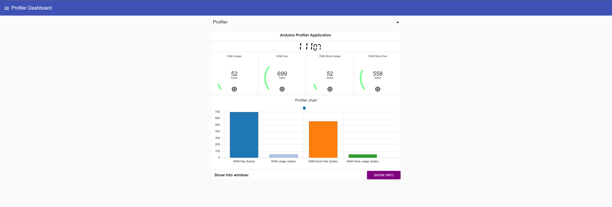

# Profiler application

This folder contains the Node-RED flow for the profiler application. The Node-RED (https://nodered.org/docs/getting-started/local) need to be installed on the host machine in order to run this application flow.

To import project into Node-RED use this guide: https://nodered.org/docs/user-guide/editor/workspace/import-export

## Profiler application demo:

## Profiler description

Simple profiler for Arduino applications, based on Node-RED and ArduinoProfiler + ArduinoJson libs.
Profiler receives JSON data from target device from UART interface. The data contains:

- RAM usage in bytes;
- Free RAM in bytes;
- RAM block usage in bytes;
- Free RAM block in bytes.