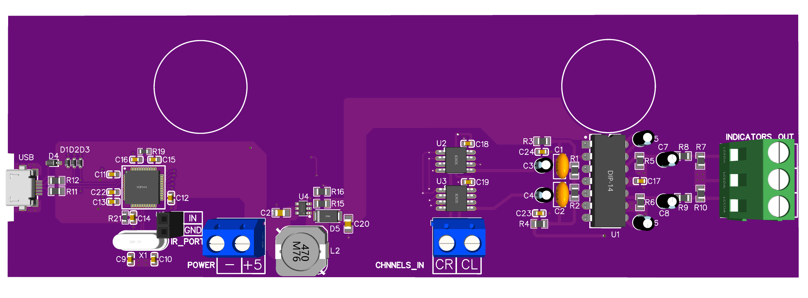

# VU-Meter digital control firmware
This is a simple firmware for the Audio VU meter. The firmware implements the IR remote control of the device.

## System architecture

The picture below shows top-level system architecture:

- USB program/debug port is used for programming and debugging process. It is disabled during normal operation. To use debug functionality the specified macro should be set in the code;
- ATMega32u4 5V MCU - digital logic control unit. Main part of the digital control subsystem. Controls the X9C102 potentiometers and receives controlling CMD`s via IR-receiver port;
- K157DA1 IC: analog VU meter IC. Used as a controller for the analog sound level indication gauges;
- MT3608 DC-DC Buck-boost converter: main power supply for the K157DA1 IC domain. Outputs 12V DC. As input takes 5V from power port and boost it to the 12V;
- X9C102 ICs: digital potentiometers (0 - 100K). Used as power limiter for the sound linear channels. The resistance range of the X9C102 IC`s limited with software to the 30K max. One X9C102 step equals to 3K. Maximum value: 30K; minimum value: 3K (10 steps in general);
- IR-receiver port: 2-pin port, used for  IR-receiving diode connection;
- Power port: main power port for the device (strictly 5V);
- Sound linear channel input port: input port for left and right sound channels;
- Indicators Out port: output port for the analog sound level indication gauges.

## Device 3D model

The picture below shows 3D model of the VU-meter device

## Project structure

Root folder contains platformio.ini configuration and additional (README.md, pictures, etc) files.
Folder structure:
- src: contains project source files;
- inc: contains project header files;
- lib: contains project specific (private) libraries;
- test: contains unit tests;
- PCB_designb: contains HW related files (schematic; gerbers and EasyEDA project);
- .vscode: contains VS Code config